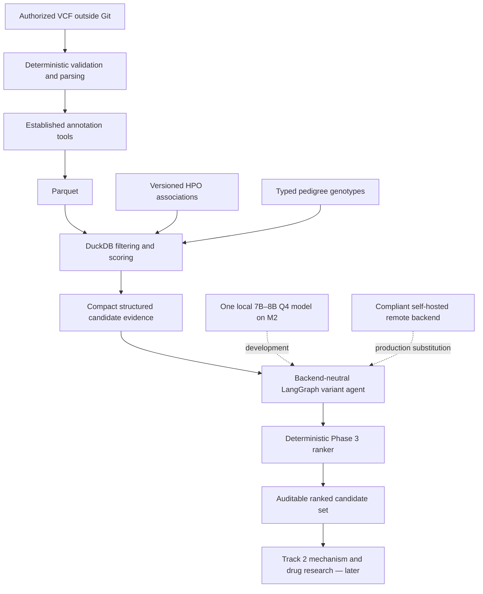

# Automated Open-Source Rare Disease AI Agent System

Local-first research software for the SageBio **Rare Disease, Real Kid: MVA Hackathon
2026**. The intended system will prioritize candidate variants (Track 1), then develop
evidence-backed drug-repurposing hypotheses (Track 2). This repository currently contains
the safe Phase 0–3 foundation: configuration, privacy controls, hardware-aware model advice,
a deterministic synthetic VCF → Parquet → DuckDB pipeline, bounded autonomous filtering,
phenotype and inheritance evidence, and preliminary variant ranking.

> **Research use only.** This is not medical advice, a diagnostic system, or a clinical
> decision-making tool. Any future drug candidates are research hypotheses only.

## Architecture



Raw variant rows never belong in an LLM context. Agents will decide which typed tool to use;
deterministic tools will execute the scientific operation and return a compact result with
provenance. See [the architecture decisions](docs/architecture.md).

## MacBook Air M2 development profile

The baseline is an Apple M2 MacBook Air with 16 GB unified memory and no CUDA GPU.

- Use MLX, Ollama, or llama.cpp-compatible Q4 models, normally 7B–8B on this machine.
- Load only one large local model; orchestrator, investigator, and critic share it.
- Keep model choice in YAML and retain a provider-neutral boundary for later GPU servers.
- Use a small biomedical embedding model and mock all LLM calls in tests.
- Inspect free memory before model launches or large data operations.
- Never download or locally run full frontier models with hundreds of billions of parameters.

The recommendation command is inspection-only:

```bash
rare-disease-agent models inspect-hardware
rare-disease-agent models recommend
rare-disease-agent models recommend --json
rare-disease-agent models check qwen2.5:7b-instruct-q4_K_M
```

It neither downloads weights nor starts a model. On a 16 GB Apple Silicon machine it applies
an 8B ceiling and flags whether current free memory is adequate. A 14B Q4 profile is only
recommended automatically when the host has at least 24 GB of memory.

## Installation

Python 3.11–3.13 is supported. Python 3.13 is recommended for the current local environment.

```bash
python3.13 -m venv .venv
source .venv/bin/activate
python -m pip install -e '.[dev]'
pre-commit install
```

No gated data, public database snapshot, model, or model weight is downloaded during install.

## Authorized dataset setup

Keep restricted data in a directory outside this Git checkout and set:

```bash
export RDA_PATHS__RESTRICTED_DATA_DIR=/absolute/private/path
```

Read [data/README.md](data/README.md) before using any challenge data. Do not use real patient
data in examples, issues, logs, tests, prompts, or commits.

## Deterministic Phase 1 pipeline

The fixture below is explicitly synthetic and stored as text so that real VCF extensions remain
globally ignored:

```bash
rare-disease-agent variants prepare \
  tests/fixtures/synthetic/variants.vcf.txt \
  /tmp/synthetic-variants.parquet
```

The parser streams records in bounded memory. Parquet writing uses bounded batches, and DuckDB
queries are parameterized. Annotation values in the fixture are synthetic stand-ins; production
annotation will call established tools such as bcftools/VEP rather than ask an LLM to infer them.

## Autonomous Phase 2 filtering

Run the complete mock-driven workflow without Ollama or model weights:

```bash
rare-disease-agent agent-filter --input synthetic --backend mock
```

The planning agent inspects aggregate statistics, creates conservative, phenotype-ready, and
pathogenicity branches, selects typed rarity/consequence/gene operations, unions the branches, and
stops automatically. The LLM backend never receives SQL or shell access and never performs a filter.
Every decision is schema-validated and written to `audit_log.jsonl` with its rationale, counts,
model/backend, prompt version/hash, result, and false-negative risk. The run also produces
`metrics.json` and `final_candidates.json` under the ignored private run directory.

The bundled truth case has 18 synthetic variants. The deterministic mock plan finishes with 10
candidates and preserves `SYNTH-CAUSAL-001`. This is an architecture/evaluation fixture, not a
clinical example or evidence of scientific performance.

Ollama is optional and must already be installed with an explicitly downloaded model:

```bash
rare-disease-agent agent-filter \
  --input synthetic \
  --backend ollama \
  --model qwen2.5:7b-instruct-q4_K_M
```

Before each Ollama request, the CLI and backend independently verify the parameter cap,
quantization, total-memory fit, and live free-memory headroom. Phase 2 permits loopback Ollama
endpoints only. An unsafe model or low-memory host is refused; no download is attempted.

## Phase 3 phenotype, inheritance, and ranking

Run one end-to-end synthetic case with the mock backend:

```bash
rare-disease-agent track1-synthetic --case de-novo
```

Available cases are `de-novo`, `recessive`, `compound-het`, `x-linked`,
`phenotype-incomplete`, and `novel-gene`. Run the complete offline benchmark with:

```bash
rare-disease-agent benchmark-synthetic --output-dir /tmp/phase3-benchmark
```

The agent chooses typed evidence operations, but deterministic tools validate HPO identifiers,
calculate Resnik best-match-average gene similarity, evaluate pedigree/genotype inheritance, and
compute the weighted ranking. The LLM never performs scoring math or receives whole genotype
tables. DuckDB persists branch membership and per-ablation scores; serialized graph state keeps
only compact gene and inheritance summaries.

Each run emits ranked candidates, phenotype/inheritance evidence, four ranking ablations, an
incomplete-phenotype ablation, causal rank/top-k metrics, and software/data provenance. The bundled
HPO and case data are synthetic. A public-only, allow-listed importer is available for pinned HPO
release artifacts, but no public dataset is downloaded automatically. HPO publishes its ontology
through the [official OBO PURL](http://purl.obolibrary.org/obo/hp.obo) and versioned
[release assets](https://github.com/obophenotype/human-phenotype-ontology/releases).

## Configuration

- `configs/default.yaml`: validated runtime defaults
- `configs/models.yaml`: development-sharing profile and backend-substitution example
- `configs/scoring.yaml`: explicitly configurable, non-authoritative score weights
- `.env.example`: environment override examples

Nested environment variables use `RDA_` and double underscores. Remote transfer of restricted
data is disabled by default.

## Testing and privacy checks

```bash
pytest
python scripts/privacy_guard.py --all
ruff check .
ruff format --check .
```

Tests use only synthetic data and do not invoke or download an LLM. The pre-commit privacy guard
rejects genomic file types, generated analytical stores, restricted directories, VCF content
without an explicit synthetic marker, and common credential patterns. `.gitignore` is a second,
independent barrier.

## Reproducibility and current limits

The normalized schema captures variant, genotype, annotation, phenotype, and evidence fields.
Phase 3 does not annotate production VCFs, use real patient phenotypes, query literature, enrich
ClinVar/VEP, generate official submissions, or implement Track 2. The preliminary score weights are
benchmarkable defaults, not claims of clinical optimality. See [model selection](docs/model_selection.md),
[Phase 2](docs/phase2.md), [Phase 3](docs/phase3.md), and the recommended
[Phase 4 plan](docs/phase4.md).

## License

[MIT](LICENSE)
