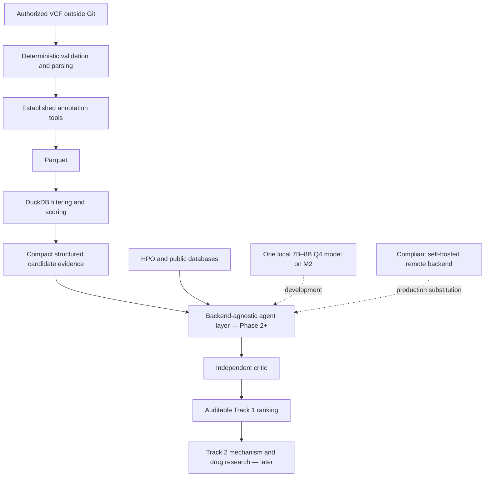

# Automated Open-Source Rare Disease AI Agent System

Local-first research software for the SageBio **Rare Disease, Real Kid: MVA Hackathon
2026**. The intended system will prioritize candidate variants (Track 1), then develop
evidence-backed drug-repurposing hypotheses (Track 2). This repository currently contains
the safe Phase 0/1 foundation: configuration, privacy controls, hardware-aware model advice,
and a deterministic synthetic VCF → Parquet → DuckDB pipeline.

> **Research use only.** This is not medical advice, a diagnostic system, or a clinical
> decision-making tool. Any future drug candidates are research hypotheses only.

## Architecture



Raw variant rows never belong in an LLM context. Agents will decide which typed tool to use;
deterministic tools will execute the scientific operation and return a compact result with
provenance. See [the architecture decisions](docs/architecture.md).

## MacBook Air M2 development profile

The baseline is an Apple M2 MacBook Air with 16 GB unified memory and no CUDA GPU.

- Use MLX, Ollama, or llama.cpp-compatible Q4 models, normally 7B–8B on this machine.
- Load only one large local model; orchestrator, investigator, and critic share it.
- Keep model choice in YAML and retain a provider-neutral boundary for later GPU servers.
- Use a small biomedical embedding model and mock all LLM calls in tests.
- Inspect free memory before model launches or large data operations.
- Never download or locally run full frontier models with hundreds of billions of parameters.

The recommendation command is inspection-only:

```bash
rare-disease-agent models inspect-hardware
rare-disease-agent models recommend
rare-disease-agent models recommend --json
```

It neither downloads weights nor starts a model. On a 16 GB Apple Silicon machine it applies
an 8B ceiling and flags whether current free memory is adequate. A 14B Q4 profile is only
recommended automatically when the host has at least 24 GB of memory.

## Installation

Python 3.11–3.13 is supported. Python 3.13 is recommended for the current local environment.

```bash
python3.13 -m venv .venv
source .venv/bin/activate
python -m pip install -e '.[dev]'
pre-commit install
```

No gated data, public database snapshot, model, or model weight is downloaded during install.

## Authorized dataset setup

Keep restricted data in a directory outside this Git checkout and set:

```bash
export RDA_PATHS__RESTRICTED_DATA_DIR=/absolute/private/path
```

Read [data/README.md](data/README.md) before using any challenge data. Do not use real patient
data in examples, issues, logs, tests, prompts, or commits.

## Deterministic Phase 1 pipeline

The fixture below is explicitly synthetic and stored as text so that real VCF extensions remain
globally ignored:

```bash
rare-disease-agent variants prepare \
  tests/fixtures/synthetic/variants.vcf.txt \
  /tmp/synthetic-variants.parquet
```

The parser streams records in bounded memory. Parquet writing uses bounded batches, and DuckDB
queries are parameterized. Annotation values in the fixture are synthetic stand-ins; production
annotation will call established tools such as bcftools/VEP rather than ask an LLM to infer them.

## Configuration

- `configs/default.yaml`: validated runtime defaults
- `configs/models.yaml`: development-sharing profile and backend-substitution example
- `configs/scoring.yaml`: explicitly configurable, non-authoritative score weights
- `.env.example`: environment override examples

Nested environment variables use `RDA_` and double underscores. Remote transfer of restricted
data is disabled by default.

## Testing and privacy checks

```bash
pytest
python scripts/privacy_guard.py --all
ruff check .
ruff format --check .
```

Tests use only synthetic data and do not invoke or download an LLM. The pre-commit privacy guard
rejects genomic file types, generated analytical stores, restricted directories, VCF content
without an explicit synthetic marker, and common credential patterns. `.gitignore` is a second,
independent barrier.

## Reproducibility and current limits

The normalized schema captures variant, genotype, annotation, phenotype, and evidence fields.
This first increment does not yet annotate VCFs, run agents, evaluate inheritance, contact public
databases, or implement Track 2. The future audit trail will record model/runtime revisions,
quantization, prompts, tool/database versions, filter parameters, seeds, source commit, and
hardware. See [model selection](docs/model_selection.md) and the [Phase 2 proposal](docs/phase2.md).

## License

[MIT](LICENSE)
